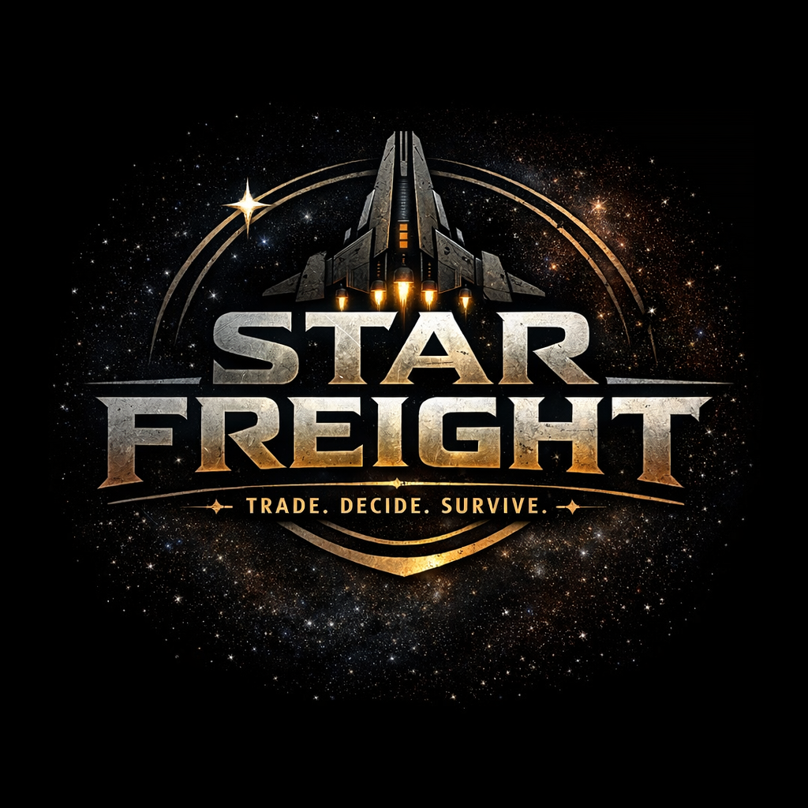

  <a href="README.ja.md">日本語</a> | <a href="README.zh.md">中文</a> | <a href="README.es.md">Español</a> | <a href="README.fr.md">Français</a> | <a href="README.md">English</a> | <a href="README.it.md">Italiano</a> | <a href="README.ko.md">한국어</a> | <a href="README.pt-BR.md">Português (BR)</a>

  

# स्टार फ्रेट

आप एक सैन्य पायलट थे। फिर आप एक बदनामी थे। अब आप एक कप्तान हैं, जिसके पास एक खराब जहाज है, कोई प्रतिष्ठा नहीं है, और एक ऐसा तारा मंडल है जो आपके आने से पहले ही गतिमान था।

**स्टार फ्रेट** एक टेक्स्ट-आधारित रणनीति, व्यापारी और रोल-प्लेइंग गेम है, जिसमें आप राजनीतिक रूप से खंडित एक तारा मंडल में माल ढुलाई करते हैं। पांच सभ्यताएं। एक अर्थव्यवस्था। चार सत्य जो आपको एक ही जीवन को दो बार जीने नहीं देंगे।

---

## खेल

आप उन स्टेशनों पर रुकते हैं जहां संस्कृति आपके बातचीत करने के तरीके को बदल देती है। आप ऐसे रास्ते चुनते हैं जहां भूभाग आपके लड़ने के तरीके को बदल देता है। आप चालक दल को किराए पर लेते हैं जो यह बदल देते हैं कि आप क्या कर सकते हैं, आप किस चीज तक पहुंच सकते हैं, और आप किससे ऋणी हैं। आप ऐसे अनुबंध लेते हैं जो सरल दिखते हैं, लेकिन फिर कागजी कार्रवाई सामने आ जाती है, कमी कीमतों को बदल देती है, या माल वास्तव में सबूत साबित होता है।

आप कोई 'चुना हुआ' व्यक्ति नहीं हैं। आप एक ऐसे कप्तान हैं जो जहाज को चलाते रहने की कोशिश कर रहे हैं, जबकि संस्थान माल जब्त कर रहे हैं, कमी मार्गों को बदल रही है, चालक दल दायित्वों को ला रहे हैं, और खतरनाक सत्य सामान्य कार्यों के माध्यम से सामने आ रहे हैं।

प्रत्येक यात्रा एक अलग कप्तान के जीवन में बदल जाती है। ऐसा इसलिए नहीं है क्योंकि आपने कोई वर्ग चुना है, बल्कि इसलिए कि आपके चालक दल, आपके रास्ते, आपके जोखिम और आपकी प्रतिष्ठा ने आपको किसी खास व्यक्ति में बदल दिया है।

## यह अलग क्यों लगता है

ज्यादातर रोल-प्लेइंग गेम्स में सिस्टम एक-दूसरे के बगल में रखे जाते हैं। स्टार फ्रेट इन सिस्टमों को आपस में जोड़ता है।

**चालक दल एक बाध्यकारी कानून है।** 'थल' सिर्फ +10% मरम्मत बोनस नहीं है। 'थल' *इसलिए* है कि आप केथ स्टेशनों पर रुक सकते हैं, *इसलिए* आपके जहाज में आपातकालीन मरम्मत की क्षमता है, और *इसलिए* आपने देखा कि चिकित्सा माल मौसम से मेल नहीं खाता था। यदि आप 'थल' को खो देते हैं, तो तीन सिस्टम एक साथ अपनी क्षमता खो देते हैं।

**लड़ाई एक अभियान कार्यक्रम है।** आप लड़ाई में प्रवेश नहीं करते और वापस नहीं आते। जीत से स्क्रैप क्रेडिट और गुट का 'हीट' मिलता है। पीछे हटना का मतलब है छोड़े गए माल और एक ऐसी प्रतिष्ठा जो यह बताती है कि आप भागने वाले हैं। हार का मतलब है जब्त किया गया माल, घायल चालक दल और एक जहाज जो सबसे नज़दीकी स्टेशन पर प्रीमियम पर जाता है। प्रत्येक परिणाम आपके अगले व्यापार निर्णय को बदल देता है।

**संस्कृति सामाजिक तर्क है।** केथ सिर्फ अलग-अलग कीमतें नहीं रखते हैं। उनके पास एक मौसमी जैविक कैलेंडर है जो यह बदल देता है कि उपहार देना क्या मायने रखता है, कब किसी सौदे को आगे बढ़ाना अपमानजनक होता है, और कब बाहरी लोगों को बाहरी घेरे में सीमित रखा जाता है। वेशान सिर्फ लड़ते नहीं हैं। वे चुनौती देते हैं - और इनकार करना हारने से भी बदतर है। ज्ञान कोई संहिता नहीं है। यह माहौल को समझना है।

**जांच जीवन से उभरती है।** आप चिकित्सा माल को मौसम से मेल नहीं खाता हुआ इसलिए देखते हैं क्योंकि आपने इसे ले जाया है। आप मैनिफेस्ट में विसंगति इसलिए पाते हैं क्योंकि आपने एक मलबे को बचाया है। आपके केथ चालक दल का सदस्य पैटर्न को इसलिए समझता है क्योंकि उसे उस आपूर्तिकर्ता के प्रति अपने ऋण की याद है। षड्यंत्र खुद को घोषित नहीं करता है। आप इसे काम करते हुए देखकर इसमें शामिल होते हैं।

## दुनिया

पांच सभ्यताएं 'थ्रेशोल्ड' नामक एक तारा मंडल को साझा करती हैं।

**टेरान कॉम्पैक्ट** — नौकरशाही मानव सरकार। उन्होंने आपको बदनाम किया। वापस आना का मतलब है परमिट, धैर्य और अपनी प्रतिष्ठा को बनाए रखना। सुरक्षित बाजार, कम मार्जिन, भारी कागजी कार्रवाई।

**केथ कम्यूनियन** — जैविक कैलेंडर पर आधारित कीड़े प्रजाति का समूह। धैर्यवान, अवलोकनशील और जब अपमानित होते हैं तो विनाशकारी। यदि आप मौसम को समझते हैं तो सिस्टम में सबसे अच्छे मार्जिन। यदि आप नहीं समझते हैं तो सबसे तेज़ प्रतिष्ठा में गिरावट।

**वेशान प्रिंसिपलिटीज** — सम्मान और ऋण से ग्रस्त सरीसृप सामंती घर। वे औपचारिक रूप से लड़ते हैं, सीधे व्यापार करते हैं और सब कुछ याद रखते हैं। ऋण खाता सिर्फ एक सजावटी तत्व नहीं है। यह एक महत्वपूर्ण उपकरण है।

**ओरिन ड्रिफ्ट** — एक गतिशील ब्रोकर सभ्यता। नीतिगत रूप से तटस्थ, लेकिन डिज़ाइन के अनुसार लाभदायक। वे सभी के साथ व्यापार करते हैं, सब कुछ जानते हैं और दोनों के लिए शुल्क लेते हैं। उन्हें छोड़ देना पैसे बचाता है। उनका अच्छा व्यवहार खोना अधिक महंगा है।

**सेबल रीच** — समुद्री डाकू गुट, प्राचीन तकनीक के खोजकर्ता, और ऐसे लोग जिन्हें 'कॉम्पैक्ट' भूलना चाहेगा। यहां कोई कानून नहीं है। कोई रीति-रिवाज नहीं हैं। कोई वापसी नहीं है। यह प्रणाली में सबसे बड़ा जोखिम और सबसे बड़ा पुरस्कार है।

## तीन प्रकार के कप्तान

एक ही दुनिया। तीन अलग-अलग दबाव।

**रिलिफ कप्तान:** काफिले का अनुशासन, विश्वास पर आधारित पहुंच, सार्वजनिक परिणाम। आप लोगों को भोजन कराते हैं और वैधता के जाल में फंस जाते हैं। आप देरी और क्षमता की कमी से डरते हैं।

**ग्रे रनर:** कागजी हेरफेर, समय का दुरुपयोग, संस्थागत जोखिम। आप अस्पष्ट रहकर पैसा कमाते हैं। आप जब्त और उजागर होने से डरते हैं।

**ऑनर कप्तान:** सीधा टकराव, घरेलू राजनीति, प्रतिष्ठा में अस्थिरता। आप समस्याओं का समाधान आमने-सामने करते हैं। आप उकसावे और कमजोर समर्थन नेटवर्क से डरते हैं।

ये कक्षाएं नहीं हैं। ये आपके द्वारा किए गए विकल्पों के कारण आप जो बन गए हैं, वही हैं।

## वर्तमान स्थिति

स्टार फ्रेट एक सिद्ध उत्पाद है, कोई डिजाइन अवधारणा नहीं।

| | गणना |
|---|---|
| स्टेशन | 9 |
| अंतरिक्ष मार्ग | 14 |
| व्यापारिक वस्तुएं | 18 |
| क्रू सदस्य | 5 + खिलाड़ी |
| अनुबंध | 9 |
| मुठभेड़ | 6 |
| जांच के धागे | 4 |
| सफलता परीक्षण | 2,161 |

'वर्टिकल स्लाइस' सभी तीन सत्यापन मानदंडों को पास कर चुका है: गोल्डन पाथ (लगातार कप्तान जीवन), एनकाउंटर (विभिन्न अभियान स्थिति के साथ तीन शाखाएं), और अर्थव्यवस्था (दबाव बिना ढहने के बना रहता है)।

तीन विस्तार पैक जारी किए गए हैं: वर्किंग लाइव्स (मानवीय पहलू), हाउसेस, ऑडिट्स और सीजर्स (संस्थागत दबाव), और शॉर्टेजेस, सैंक्शंस और काफिले (नियंत्रित कमी)।

कप्तान पथ विचलन सिद्ध है: तीन दृष्टिकोण अलग-अलग रास्ते, अलग-अलग व्यापार मिश्रण, अलग-अलग युद्ध प्रोफाइल, अलग-अलग विफलता परिदृश्य और अलग-अलग कप्तान पहचान उत्पन्न करते हैं।

## तकनीक

पायथन 3.11+। रिच टीयूआई। [पोर्टलाइट](https://github.com/mcp-tool-shop-org/portlight) से लिया गया है - एक 1,832-टेस्ट समुद्री रणनीति इंजन जो व्यापार सिमुलेशन, अर्थव्यवस्था मॉडल और विश्व-अवस्था आर्किटेक्चर प्रदान करता है। स्टार फ्रेट क्रू बाइंडिंग, ग्रिड कॉम्बैट, सांस्कृतिक ज्ञान, जांच और अभियान ऑर्केस्ट्रेशन को इसके ऊपर जोड़ता है।

कोई बाहरी एआई निर्भरता नहीं। कोई क्लाउड सेवाएं नहीं। यह आपके मशीन पर चलता है।

## नियम

जब आपको यह तय करने में संदेह हो कि आगे क्या बनाया जाए:

- क्या यह चार सत्यों में से किसी को मजबूत करता है?
- क्या यह कप्तान के जीवन को बेहतर बनाता है?
- क्या यह एक ऐसा निर्णय बनाता है जिसे खिलाड़ी महसूस कर सके?

यदि नहीं, तो यह प्रतीक्षा कर सकता है।

---

*स्टार फ्रेट एक ऐसा खेल है जो शक्ति के प्रणालियों के माध्यम से आगे बढ़ने के बारे में है, बिना कभी पूरी तरह से उनमें शामिल हुए।*
